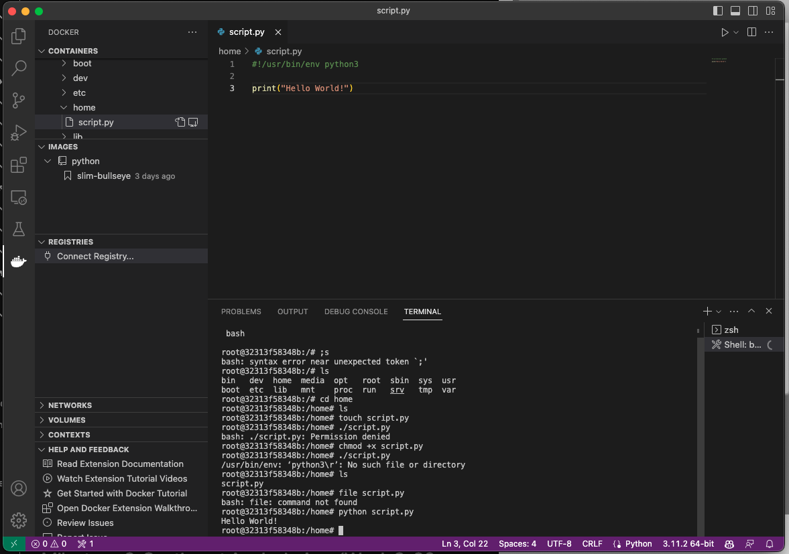

# Milestone 1

## Steps
1. Looked for Python images on Docker
    - https://hub.docker.com/_/python/tags

2. Ran `docker pull python:slim-bullseye`
3. With the image downloaded, we can create a container to do our dev work
    - `docker run -it --entrypoint bash python:slim-bullseye`

4. VSCode additionally comes with a Docker extension to link the IDE to local containers
5. Run Python!

